# Elemental Sandbox

A skillshot VFX sandbox built with **Three.js**, **Vite** and hand-written **GLSL**.


Seven abilities and five ways to aim them. Press the key to arm, the appropriate targeting
indicator appears, swing it with the mouse, click to fire. One ability is a **line cast** (the
arrow), three are **far casts** (a thick boundary that follows the cursor and answers the only
question a ground-targeted AoE has to answer before you commit — how much space this is going to
take), one is a **gate cast** (the only one that builds a structure standing on the floor), one
is a **ring cast** (a structure that is forged lying down and then hinged up to stand), and one is
a **scribe cast** (a hole struck into the air at a chosen size, with no footprint on the ground
at all).

**Q — Pyre Crown.** A line of fire races out across the floor, the ground inside the circle splits
and goes molten, and a ring of burning blades tears up out of it — leaning outward, fanned so they
cross, of wildly uneven height — which stands, burns, throws embers up through its own middle on
the column of hot air over the crater, and is then *consumed*: eaten down from the points to the
floor and left as ash. The middle of the footprint is held open on purpose, because the read of the
ability is a wall you are looking *into*, and filling the disc stops it being a ring.

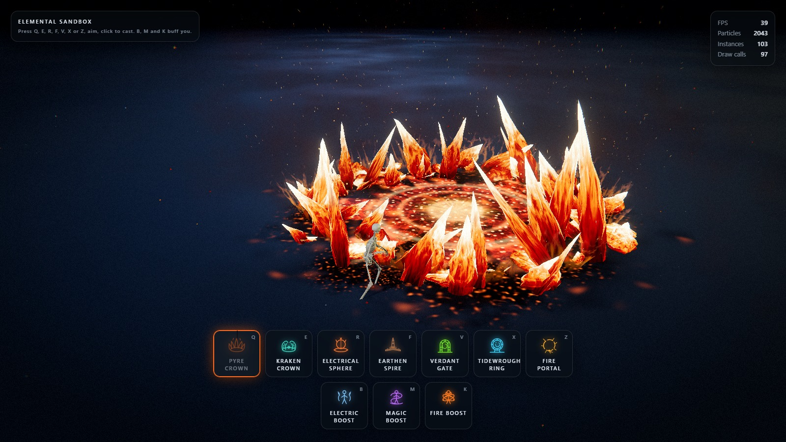

**E — Kraken Crown.** A slick of black water runs out to the aimed point, the flagstones inside the
circle give way, and a ring of cephalopod arms hauls itself out of the rift — uncoiling as it comes,
rearing back over the floor — and then *hammers the middle of the footprint* over and over. Each
landing throws stone, spray and ink, the slams arrive as rolling thunder rather than in unison, and
the cast ends with one synchronised slam and the arms dragging themselves back into the hole.

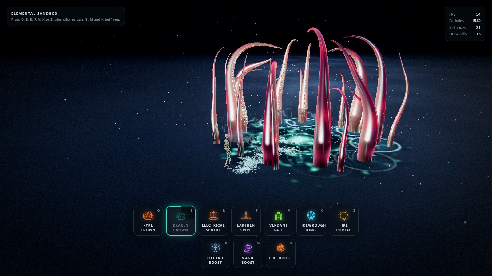

**R — Electrical Sphere.** A line of current is whipped out across the floor; where it lands the
ground splits, a containment platform blooms out, and a dark polished sphere rises out of the middle
and hovers there — mirroring the room, ringed in Fresnel light, electricity crawling flat across its
skin and arcs tearing off it — until it collapses inward and vanishes.

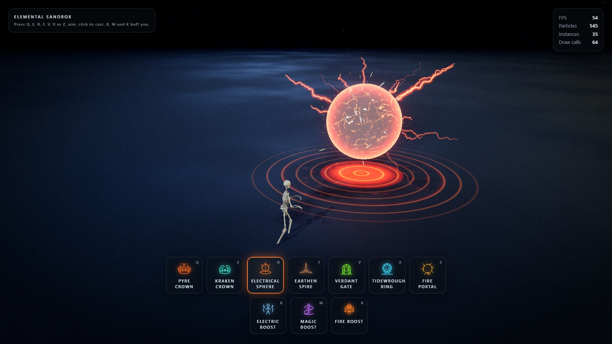

**F — Earthen Spire.** The only line cast. A crust of stone plates is laid down along the aimed line
behind a travelling front, a fracture wave trails the head and breaks the crust open, boulders are
thrown up through the cracks, and — at the end of the line — a stone tower climbs out of the floor
with a ring of boulders shouldered up around its plinth.

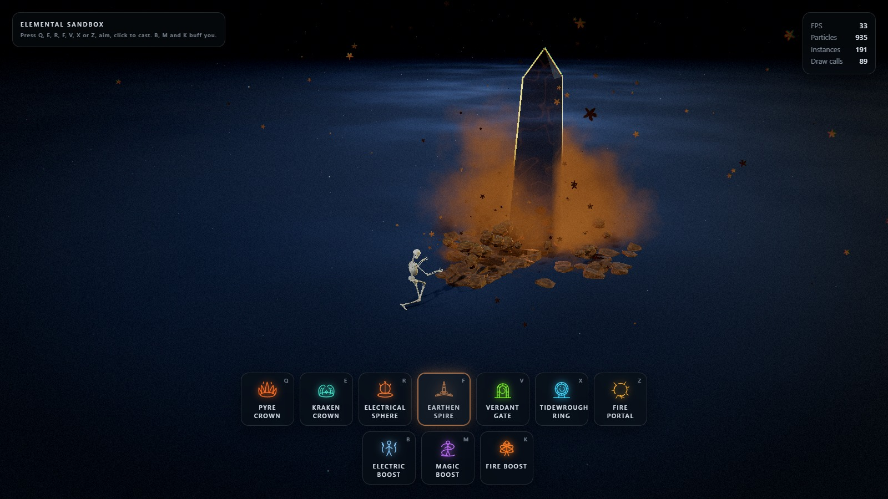

**V — Verdant Gate.** The first gate cast. A seam of green races along the aimed line to the site,
quarried blocks break out of the floor outside the footprint and swing up into their slots, both
jambs climbing together, the outer courses lagging the inner ones, the keystone seating last with
the only shake worth feeling — and then the portal floods the opening and *stays lit* until another
gate is raised, at which point the standing one is asked to come apart, keystone first.

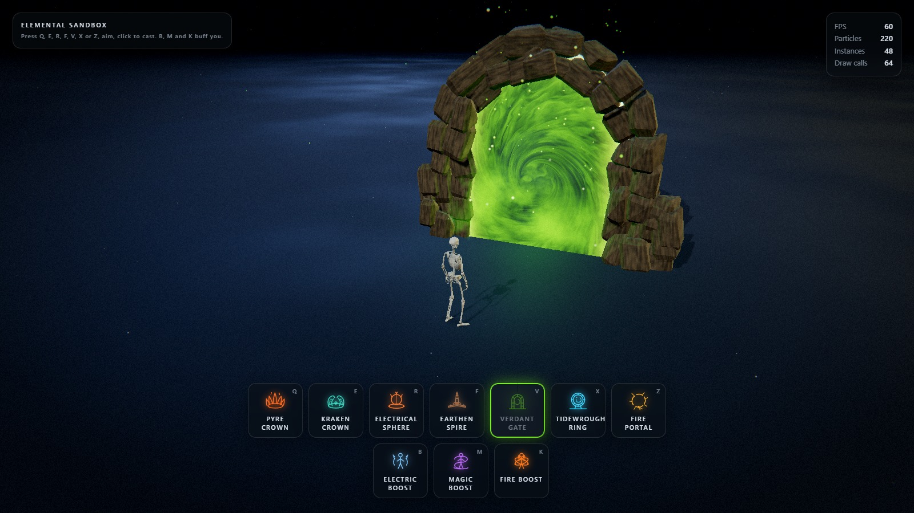

**X — Tidewrought Ring.** The first ring cast. A tide of light runs out along the aimed line, the
ring is then *forged lying down* — segments swing in out of a wide orbit in the ground plane,
spiralling inward against the ring's own rotation and locking from the foot upward, both arcs closing
on the crown, with a band of runes lighting behind them one mark at a time — the finished hoop
stands up, hinging off the floor about its own lateral axis and settling a few degrees past
vertical, and the horizon irises open from the middle out, slams into the rim, and stays lit.

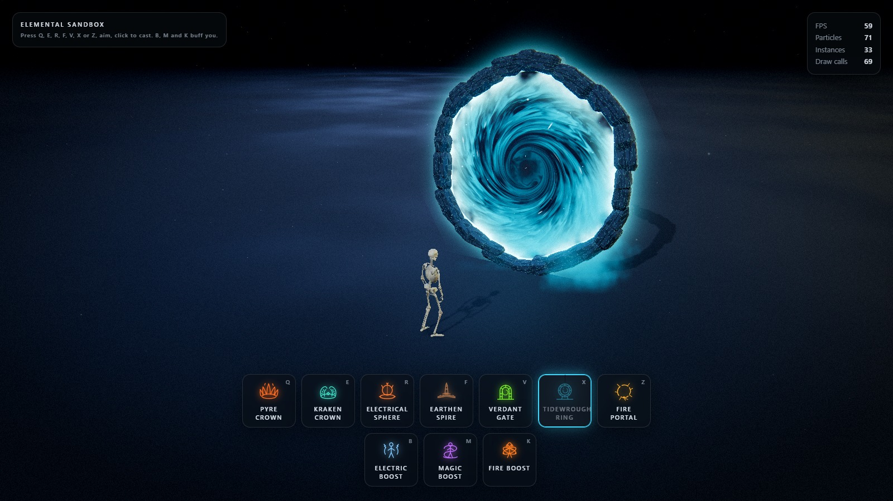

**Z — Fire Portal.** The first scribe cast. A black disc is *struck* into existence — a spark is lit
at the foot of the circle and runs all the way round it, and the contour it traces is the way
through, drawn from the middle out. The ring behind the disc is a circle standing in the air that
throws stretched sparks off itself on a tangent, all the way round, every frame. The way through is
the only portal in the sandbox that *takes* the opening away rather than putting light in it.

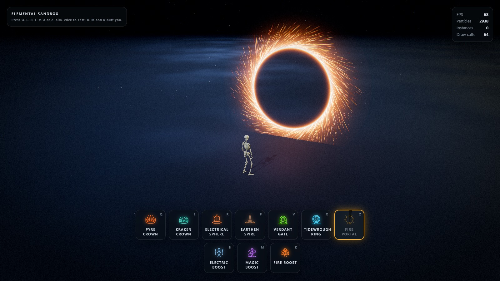

Outside the arm-and-cast loop sit three self-buffs: **B** Electric Boost, **M** Magic Boost, **K**
Fire Boost. None of them is selected, none of them is aimed, and any of them, all of them, or none
can be running at once.

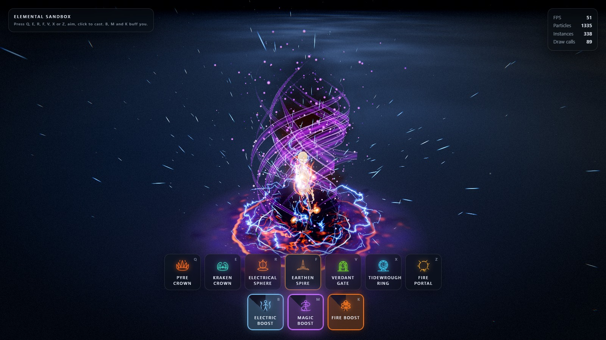

Everything you can see is generated. There are no sprite sheets and no meshes on disk except the
character: the blades are procedural geometry, the arms are procedural tubes bent entirely in a
vertex shader, the electrical arcs are instanced ribbon, the plates and rocks and gate blocks are
procedural geometry, the beam of light through the portal and the hole through the fire portal are
two passes of one quad, the arrow, the targeting circle, the burns and the molten cracks are
signed-distance and noise shaders, and the mist, sparks, embers, ink and chips are GPU particles.

**Every parameter is a live slider** — and they stay live while the simulation is paused. That is
the point of the project: freeze a frame mid-eruption, mid-strike or mid-burn with **P**, then
reshape the silhouette, the palette and the timing against a still image.

---

## Quick start

```bash
npm install
```

```bash
npm run dev
```

Then open the URL Vite prints (default <http://127.0.0.1:5173>).

```bash
npm run build
```

```bash
npm run preview
```

### Assets

The binary assets are served from `public/` and loaded automatically at boot:

| File | Purpose |
| --- | --- |
| `public/models/Idle.fbx` | Rigged character **and** its idle animation clip |
| `public/models/diffuse.png` | The character's colour map |
| `public/models/cast1.fbx` | Cast animation |
| `public/models/cast2.fbx` | Cast animation |
| `public/models/cast3.fbx` | Cast animation |
| `public/hdri/spruit_sunrise.hdr` | HDR probe used for image-based lighting and reflections |
| `public/textures/cathedral/*.jpg` | The stone tiling that dresses the stage floor (albedo, normal, roughness, AO) |
| `public/textures/textures.glb` | A small material library kept as a fallback for the character skin |

All four FBX files are Mixamo exports of the same rig, each carrying a skinned mesh plus one
animation stack. The character comes from the idle file; the cast files are loaded for their clip
alone, and the duplicate rig that arrives with each one is released the moment its `AnimationClip`
has been taken. Clips bind to the skeleton by bone name, which is the whole reason an animation
authored in another file plays here without retargeting.

The rig ships no material, so `diffuse.png` is loaded beside it and assigned as the colour map when
the imported materials are converted to PBR — an FBX that *does* carry an embedded texture keeps its
own, since that map is authored against its own UVs.

Every ability picks the clip it throws — `castAnim` in its settings block, a dropdown under **The
cast** in its editor folder. The clip is a one-shot laid over the looping idle, with
`character.castBlendIn` / `character.castBlendOut` as the two edges of that overlap.

The HDR is loaded as image-based lighting and as the reflection source for the electrical sphere and
the magic boost ribbon. The stage keeps its flat dark backdrop; the HDR is sampled, never shown.

---

## Controls

| Input | Action |
| --- | --- |
| **Q** (or **1**) | Arm Pyre Crown — a far cast, aimed with a circle |
| **E** (or **2**) | Arm Kraken Crown — a far cast, aimed with a circle |
| **R** (or **3**) | Arm Electrical Sphere — a far cast, aimed with a circle |
| **F** (or **4**) | Arm Earthen Spire — a line cast, aimed with the arrow |
| **V** (or **5**) | Arm Verdant Gate — a gate cast, aimed with a threshold and a standing arch |
| **X** (or **6**) | Arm Tidewrought Ring — a ring cast, aimed with a sigil the ring tips up out of |
| **Z** (or **7**) | Arm Fire Portal — a scribe cast, aimed with a circle a spark runs round |
| **B** | Electric Boost — a self buff; press again to let go |
| **M** | Magic Boost — a self buff; press again to let go |
| **K** | Fire Boost — a self buff; press again to put it out |
| **Move the mouse** | Swing the aim arrow, or move the far-cast circle |
| **Left click** | Cast along the arrow, or drop the circle where it is |
| **Esc** / **right click** | Cancel an armed cast |
| **Right mouse + drag** | Orbit the camera |
| **Scroll** | Zoom |
| **G** | Show/hide the VFX editor |
| **P** | Pause / resume — *the editor keeps applying* |
| **C** | Clear all active effects |
| **H** | Hide the controls panel |

`range` and `minRange` are per ability, so the indicator's reach changes with the slot you have
selected. Aiming closer than the selected ability's `minRange` tints it red and refuses the cast;
set `minRange` to 0 if you would rather cast at your own feet, which is what the Pyre Crown ships
with — a ring of fire around your own feet is a legitimate play. Cooldowns are per ability too, so
spending one slot never locks the other out.

The three boosts are not slots: nothing selects them and nothing aims them, so they sit outside the
arm-and-cast loop entirely and are simply switched on. Any of them, all of them or none can be
running at once — where two want to light the character's own materials, the stronger claim wins
(see `src/materials/FresnelAura.js`). Fire Boost differs from the other two in where it hangs its
effect: its flames are rooted on the rig's **actual bones**, so the fire on a forearm swings with
the arm, and its orbiting embers trail wakes that are the orbit *sampled backward in time* rather
than a recorded path — which is why dragging their tilt re-sweeps a second of fire instantly, even
paused.

---

## Project layout

```
src/
  abilities/      Ability base class (the travelling front, phase machine, light bookkeeping),
                  PyreAbility, KrakenAbility, ElectricalSphereAbility, EarthAbility,
                  PortalAbility, AetherRingAbility, FirePortalAbility, AbilityManager
  animation/      FBX character loading, AnimationMixer, the per-ability cast clips,
                  the procedural cast lunge
  assets/         Procedural geometry: crystals, plates, blocks, rocks, towers, arms,
                  bolt ribbon strip
  config/         settings.js — the single source of truth for every parameter
  core/           App, Renderer, CameraRig, Time, Layers, shared frame uniforms
  effects/        Aim arrow, far-cast circle, gate/ring/scribe templates, reach ring,
                  ground decals, fissures, bursts, light pool, the three boosts,
                  shake, flash
  input/          InputManager (events) and AimController (the five targeting shapes)
  loaders/        AssetLoader with a shared LoadingManager
  materials/      PyreMaterial, KrakenMaterial, ElectricalSphereMaterial, RockMaterial,
                  GlassMaterial, RadialBoltMaterial, EmberFieldMaterial, AbyssFieldMaterial,
                  FireBodyMaterial, FresnelAura, ArcaneRibbonMaterial
  particles/      GPU particle system + engine and rate emitters
  postprocessing/ Composer pipeline, grade shader
  shaders/lib/    Shared GLSL: noise library, common helpers
  ui/             HUD, lil-gui editor, preset manager, glyphs, styles
  utils/          Maths, colour cache, pooling, disposal, shader patching
  world/          Environment (stage lighting), floor, dust, contact shadows
  archive/        The retired four-element sandbox — see archive/README.md
```

---

## How it fits together

### Settings are the API

`src/config/settings.js` holds every tweakable value. Nothing else owns that state: shaders,
particle systems, lights and post passes *read* those objects every frame. That is what makes the
editor work with no rebuild — moving a slider changes the crown that is already standing, the next
cast, the environment and the post stack at once. Preset loading deep-merges *into* the same
objects so every live binding stays valid.

```js
import { settings } from './config/settings.js';
settings.pyre.height = 7;          // visible on the next frame, even mid-cast
settings.kraken.zoneRadius = 5;     // re-hammers a rift that is already standing
settings.global.timeScale = 0.1;    // slow the whole simulation to a crawl
```

Ability blocks are keyed by their id in `ELEMENTS`, and the shared systems that need to know
"which ability is the player holding" — the aim controller, the cooldowns, the HUD — look it up as
`settings[element]`. The four fields they rely on being present are `range`, `minRange`, `speed`
and `cooldown`; a far cast adds a fifth, `zoneRadius`, and a ring or scribe cast adds a sixth,
`ringRadius` and `ringHover`. Everything else in a block is that ability's own business.

### The rule that makes "edit while paused" work

A blade record in `PyreAbility` stores **only what the dice decided**: a seat, a height jitter, a
lean, a combustion delay. Not one metre, radian or second is captured when the cast starts. Every
dimension is resolved against `settings.pyre` inside the update loop, which runs on a zero-length
frame too.

So dragging `height` re-grows a crown that is already standing; dragging `clumping` re-packs it
toward the centre line; dragging `zoneRadius` re-hammers a kraken that is already mid-strike. The
only values a record *does* capture are timestamps — the moment its own eruption was triggered.
Those are events, not dimensions.

The four *shape* controls (`facets`, `taper`, `roughness`, `bend`) cannot be expressed as a
per-instance transform, so they are baked into the geometry instead — and a six-sided blade is just
60 triangles, cheap enough to regenerate outright rather than approximate in a vertex shader.
`PyreAbility#_syncGeometry` hashes those four values and rebuilds the three blade meshes when the
hash changes, which is what keeps them live sliders rather than restart-required constants.

The same rule runs through every ability in the project. The kraken arms store dice, never metres;
the arms' length is derived from `zoneRadius` through the closed form for a constant-curvature
arc, which is the one piece of geometry the file owns outright, and every other pose is read off
`settings.kraken` on every update.

### Aiming

`AimController` raycasts the pointer onto the ground plane **every frame**, not only on mouse
move, so orbiting the camera with a cast armed swings the indicator under a stationary cursor. It
clamps the distance into `[minRange, range]`, tracks a 0..1 reveal envelope, and emits a single
`cast` event carrying an origin, a unit direction and a distance — which is exactly the signature
`Ability#spawn` takes. It decides nothing about what the cast does.

It runs on **real** time rather than the scaled simulation delta, so the indicator keeps animating
while the sandbox is paused.

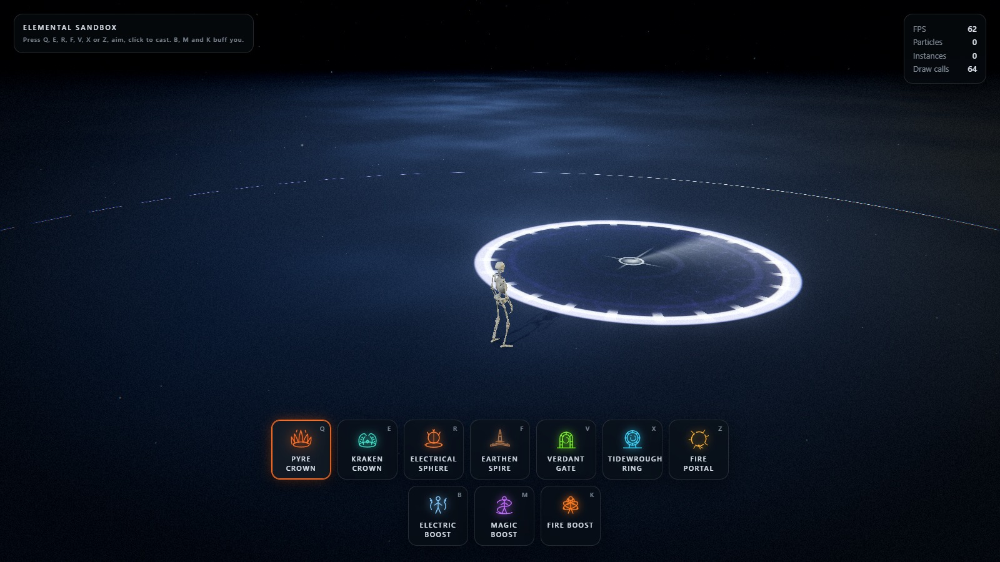

*A far cast armed: the boundary follows the cursor and shows the footprint before you commit.*

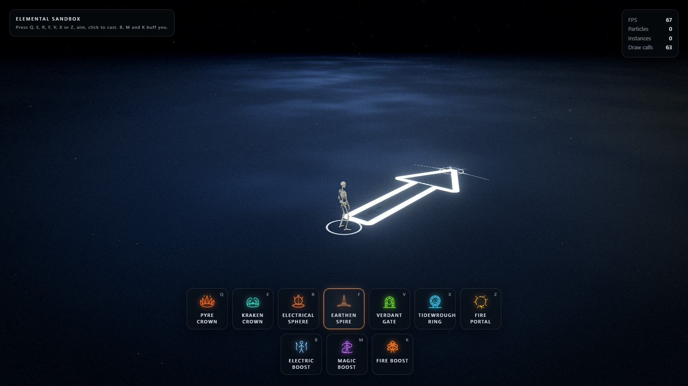

*The line cast: one arrow, drawn as a signed-distance field, swung with the mouse.*

There are five indicators and one controller. Which one is drawn comes from
`ELEMENT_META[element].cast` — `CastShape.LINE`, `CastShape.ZONE`, `CastShape.GATE`,
`CastShape.RING` or `CastShape.SCRIBE` — and that is the *only* thing the five shapes disagree
about. Arming, clamping, validating, revealing and firing are shared, and all five end in the same
three-argument `cast` event, because from the targeting side a far cast is a line cast you only
care about the far end of, a gate cast is one you also care about the heading of, a ring cast is
one you also care about the upright pose of, and a scribe cast is one that has no footprint at
all. That is why none of those targeting shapes needed a change in `Ability` or `App`: each reads
its site as `pointAt(1)` and works outward from there.

### The far-cast circle

`ZoneIndicator` is the arrow's opposite number, and it is built out of the same two ideas: metres,
and no textures.

The **footprint** is one quad whose fragment shader remaps UV into metres from the target, so the
boundary stays 0.34 m thick whether the circle is 2 m or 8 m across. The band is deliberately the
heaviest mark on screen — it is the whole message — and it is split about the nominal radius by
`boundaryBias` rather than centred on it, so its *outer* lip stays honest about where the effect
ends. Inside there is a rim-weighted wash, contour rings travelling outward, warped filaments and a
reticle whose downrange arm is longer, because the quad carries the caster's yaw and that arm is
therefore the heading.

The **reach ring** at the caster is the bolt's ribbon strip bent into a circle: `(t, side)` in,
world position out. A quad big enough to hold a 20 m range would be 40 m across and shade a
screenful of discarded fragments for one thin line.

The circle **snaps out past its radius and settles back** when the cast is armed, and the trap does
the same thing when it lands. A circle that grows linearly reads as a UI element; one that
overshoots reads as something the caster did.

### The arrow is one SDF

`AimIndicator` is a single ground quad. Its fragment shader remaps UV into **metres measured from
the caster**, so every control in `settings.aim` is a real measurement — the shaft stays 0.42 m
wide whether the cast is 3 m or 15 m long.

The silhouette is a rounded union of a box (the shaft) and iq's exact triangle SDF (the head);
the cheap half-plane intersection leaves visible corner artefacts on a wedge this shallow. From
that one distance field the shader derives the outline, the rim-weighted interior wash, the
chevrons (a phase skewed by `|x|`, which turns flat bands into arrowheads pointing the way the
cast does), the frost noise and voronoi plates, the ring at the caster's feet, the range cap arc,
a six-fold frost rosette pinned to the impact point, and the sweep-out when the ability is armed.

### The gate template

The second targeting shape, and the first one that leaves the floor. An arrow answers *which way*
and a circle answers *how much ground*; neither answers the question a **structure** raises, which
is what will be standing there and which way it will face.

`GateIndicator` draws three things, all in metres and none of them a texture: a **threshold** on the
floor — a slot the width of the opening with a heavy pad under each jamb, so the footprint the
stones will take is honest — the shared **reach ring**, and the **ghost**: the arch itself, standing
upright in the gate's own plane, drawn from the same `archDistance` SDF the portal surface uses. It
draws itself floor-upward as the cast is armed, which is the order the gate is built in, and it is
the only way a targeting indicator can show a *facing*: stand the silhouette up and let the camera
see it edge-on when you are about to build it edge-on.

The ghost reads `gateWidth` and `gateHeight` off the ability rather than off its own settings block,
so the preview and the gate that gets built can never disagree.

### The ring template

The third targeting shape, and the first one that previews a **sequence** rather than a shape.

The gate template can stand its silhouette up and leave it standing because a doorway is built
where it stands. A ring is not: it is forged flat on the floor and then raised, so a template that
only drew the standing pose would be promising the wrong half of the cast. `RingIndicator` draws
the **sigil** — the disc of floor the segments will be laid on, carrying the ring's own lobed
contour, one tick per segment and one spoke per course — and the **ghost**, which is drawn lying on
that sigil and **tips upright as the cast arms**, on the same overshooting settle the cast itself
uses. Arming is a rehearsal of what the click will do.

The contour is not a circle. `ringDistance` modulates the radius with a few shallow lobes, because
a true circle is the one shape that reads as *drawn* rather than as *made*; the same SDF is shared
with the rift surface, the way `archDistance` is shared with the portal's.

Like the gate's ghost, it reads `ringRadius` and `ringHover` off the ability rather than off its own
settings block, so the preview and the ring that gets built can never disagree.

### The scribe template

The fourth targeting shape, and the only one that does not answer a question about the floor. A
gate takes a *footprint* and a ring takes a *footprint*; a portal cut in mid-air has a reach and
has no footprint at all.

`ScribeIndicator` is the circle the spark will run round, held at `ringHover` off the floor so the
player can see what height the portal will hang at. It never touches the ground; the reach ring
alone carries the distance read, because a structure with no base needs no shadow of itself on
the floor. Like the ring and gate templates, it reads `ringRadius` and `ringHover` off the
ability rather than off its own settings block.

### The earth

`EarthAbility` is the only line cast, and the only ability whose travelling front is the whole
point rather than a lead-in to something that happens at the end of the line.

The arrow is read as usual; the front then races along the line at the live speed and lays down
three things in order. First, a **crust of stone plates** that surfaces flush with the floor as
the head passes over it. Second, a **fracture wave** that trails the head by `crackDelay` and
breaks that crust — plates heave, tip over, drop into the seams and slide apart. Third, at the end
of the line, a **stone tower** climbs out of the floor with a ring of boulders shouldered up
around its plinth. All three are real geometry (instanced plates, instanced rocks, one tower
mesh) so they take the scene's shadows, and everything is pooled — a cast allocates nothing.

The tower is the one piece worth calling out. Its body is a procedural cylinder of stone
segments — `createTowerGeometry` — that builds in courses, the outer courses lagging the inner
ones. Inside the cylinder sits a `GlassMaterial` core carrying a slow swirl of its own colour,
which is what makes the tower *glow* rather than just be lit: the room shadows the outside, the
core carries the light. A thin outline of additive bloom hugs the silhouette; drag `glow` and
the whole tower reads as something hot inside, drag it to zero and the same tower reads as
weathered stone.

The base class's linear phase machine does the front travel and the phase transitions; this file
just resolves every metre and second against `settings.earth` inside the update loop, which is
what keeps the editor live.

### The pyre

`PyreAbility` is the first **far cast** and the first ability to plant something in a ring. A
line of fire runs out across the floor to the aimed point, the ground inside the circle splits and
goes molten, and a ring of burning blades tears up out of it — leaning outward, fanned so they
cross, of wildly uneven height — which stands, burns, throws embers up through its own middle on
the column of hot air over the crater, and is then **consumed**.

The **middle stays open** on purpose. Every blade is seated in a band about `zoneRadius` and
nothing is planted in the centre of the footprint, because the read of the ability is a wall you
are looking *into* — fill the disc and the ring stops being a ring. The pyre is kept as a control
(`coreShare`) but ships at zero.

Three roles, three draw calls, three silhouettes. Each role is its own `InstancedMesh` because
the *facets* differ, not just the proportions — per-instance scaling alone cannot buy that
silhouette variety.

Three pieces worth calling out:

**The blades are opaque fire, not transparent glass.** `PyreMaterial` is one domain-warped flame
field, squashed along the blade's axis and scrolled so it climbs, run through one four-stop heat
ramp and then pushed through a contrast curve (`sharp`) — which is the single control that turns
a soft gradient into tongues with black voids between them. The whole blade is emissive; the
HDR is sampled for the highlight, not for the body.

**The eruption is strictly monotonic.** A flame that bounces onto its height reads as rubber; a
physical blow that *did* bounce is a different effect, and the pyre is not trying to be one. There
is no overshoot term in the Pyre's settings block at all. `riseSnap` blends two curves that both
land exactly on 1 and neither of which crosses it, and `creep` then approaches a little past full
height from *below*, forever, which is what a flame does when it settles.

**The air inside rises.** The signature is an updraft — embers released at the floor and carried
up the column over the crater, orbiting its middle as they climb (`ParticleSystem`'s swirl mode,
anchored on the centre). `ParticleSystem`'s swirl is the only thing in the project that gives
particles an angular velocity, and it is the only thing the pyre needs, because what *says* fire
isn't the flame field on the blades — it is the column of hot air the blades are standing in.

### The kraken

`KrakenAbility` is the second **far cast**, and the first ability in the sandbox made of something
that is *alive*.

Where the pyre's identity is in its material, the kraken's is in its motion. Both crown the
footprint with a ring of things around the edge and leave the middle empty; the pyre's blades
are static the moment they reach full height, and the kraken's arms are never the same on two
consecutive frames. This is the ability the editor is most worth pausing for, because the beat
is the content.

Five beats, in order. (1) **Travel** — the wet surge runs out across the floor, slicking it.
(2) **Tear** — the rift opens outward to the boundary and the arms come up as a sweep, the
nearest first, the wave running around both sides. Each arrives *coiled* and uncoils onto its
rear as it rises, because that is what actually comes out of a hole: a curl, opening. (3)
**The hammering** — the body of the cast. Every arm runs its own strike cycle — rear, whip,
press, peel — scattered around the ring so the slams arrive as rolling thunder rather than in
unison. The whips run theirs faster and land far lighter. (4) **The finale** — one strike that
ignores the scatter: every arm lands on the same frame, on the same spot, and the room is hit
accordingly. (5) **Withdrawal** — the arms shorten back into the rift, tips last, and the water
closes over them.

Two pieces of that are worth calling out:

**The arms actually hit the middle, and it is arithmetic rather than tuning.** A constant-curvature
arc of length `L` turning through `Θ` puts its tip `L(1−cosΘ)/Θ` along the bend and `L·sinΘ/Θ`
above the floor. At `Θ = π` that is `(2L/π, 0)` — on the ground. So an arm of length `πR/2` seated
on a footprint of radius `R` strikes its exact centre, and the ability derives every arm's length
from `zoneRadius` through that identity rather than from a tuned constant. Drag the footprint
slider *while they are hammering* and they keep hitting the middle. The same closed form gives
the CPU the impact point for free — no readback, no guess — which is what every slam's shockwave,
debris and spray is placed with.

**The arm is bent in the vertex shader.** `createTentacleGeometry` bakes a tapered tube standing
straight up +Y and it is never drawn in that shape. `KrakenMaterial` integrates a curvature
profile — a lean, a curl and a travelling wave — up the arm, per vertex, per frame, and rebuilds
the local frame at every ring from the same integral. Coiling out of a hole, rearing, whipping
down and peeling back off the floor are that profile with four numbers moved. Nothing about the
animation touches the CPU, and one `InstancedMesh` per silhouette draws the whole ring.

The skin is the only shaded material in the file that is not energy. It is lit by the room's own
sun, has a wet specular coat and one sample of the HDR probe, and carries three things nothing
else does: chromatophore bands travelling the length of the arm (real cephalopods do exactly
this, and it is what says *alive*), two staggered rows of suckers laid down the ventral face —
which is why the baked `uv.x = 0` is anchored on the side the arm curls toward — and
bioluminescence spent almost entirely on the sucker rims, because the inside of a curl is the
side that faces you across the ring.

The air inside hangs. The Pyre Crown's embers race up; the Kraken Crown's marine snow does
neither: high drag and near-zero gravity, so the motes lose their launch speed at once and simply
sit there, turning slowly about the throat. It is what says the space inside this ring is full of
water.

Its rift splits the same way the Pyre Crown's crater does, and for the same reason: the dark half
is a `SCORCH` decal in deep navy under an additive quad.

### The electrical sphere

`ElectricalSphereAbility` is the third **far cast**, and the only one that *holds* a single
object in the air.

The caster whips a line of current out across the floor to the aimed point; where it lands the
ground splits, a containment platform blooms out, and a dark polished sphere rises out of the
middle and hovers there — mirroring the room, ringed in Fresnel light, electricity crawling flat
across its skin and arcs tearing off it — until it collapses inward and vanishes.

The whole effect is three GPU shaders, all of which read `settings.electrical` every frame and
re-resolve themselves on a zero-length frame, so the editor's sliders reshape a sphere that is
already standing, with the clock paused.

- **`createSphereBodyMaterial`** — the sphere itself: an opaque, near-black reflective shell. It
  mirrors the scene HDR in the view-reflection direction with a Fresnel weight, takes a hard
  specular glint, carries a restriking discharge net across its skin, and is lit around its
  silhouette by Fresnel alone. It writes depth, so it occludes properly.
- **`createPlatformMaterial`** — the containment disc on the floor. Same vocabulary (rings, hex
  grain, hot inner band, outward pulse rings) so the sphere reads as seated on a device.
- **`createRadialBoltMaterial`** — the chaotic arcs. Instanced ribbon geometry; every instance is
  a bolt from a random point on the sphere surface to a random point out in space, re-struck on
  its own clock.

The pulse is a `pulse()` function of `age` — a smooth organic envelope that fires roughly twice a
second. It is *added* to the materials' `uPulse` uniform and *multiplied* into the particle
emitter rates, so the whole effect breathes in time. It is **not** a scale animation.

A cast captures a seed, and a few timestamps. Nothing else. The radius, the noise scale, the arc
count, the pulse frequency — every one of them is read off `settings.electrical`.

### The gate

`PortalAbility` is the first cast that **builds** something and leaves it there. Everything else
in the sandbox is an event — it happens, it fades, the pool takes it back. A gate is a place.

Three beats. A seam of green races along the aimed line to the site (the base class's travelling
front, doing its usual job). The arch is then **constructed**: quarried blocks break out of the
floor outside the footprint and swing up into their slots, both jambs climbing together, the outer
courses lagging the inner ones, the keystone seating last with the only shake worth feeling. Then
the portal floods the opening and **stays lit** — until another gate is raised, at which point the
standing one is asked to come apart, keystone first.

Two pieces of that are worth calling out:

**The stones hold no metres.** Each one stores where it sits along the contour as a signed 0..1 —
which jamb, and how far up toward the keystone — plus its course and its dice. Every position,
angle and size is resolved against `settings.portal` each frame, so dragging the span of a gate
that has been standing for a minute re-lays the whole arch around the new opening, keystone
included, while the clock is paused. It is the same rule the rest of the project runs on, and a
standing structure is where it pays the most: this is the one cast you can walk around and study.

**The opening is never geometry.** The surface is one quad carrying the arch's SDF in its fragment
shader, which is why the aperture can flood open and the span can be dragged without anything being
rebuilt. The vortex inside it is a logarithmic spiral — winding the radius through a `log` is what
turns concentric rings into a funnel you can read depth in — over a colour floor that keeps the
whole opening lit, because a surface with dark patches in it reads as a hole in the wall rather
than as a gate. The halo that spills onto the stones is the same quad drawn a second time
additively, and the seams in the blocks themselves are lit by the portal's own colour, so the arch
goes dark the moment the gate shuts.

The blocks are `createBlockGeometry`, not the boulder the spire heaves up: a chamfered box with
flat faces and chipped edges, knocked off independently at all eight corners. An arch is something
somebody stacked, and a round rock reads as the opposite of built. Two seeds are instanced side by
side, because a single silhouette repeated forty times is what gives a procedural wall away.

### The ring

`AetherRingAbility` is the gate's argument answered by an engineer instead of a mason, which makes
the pair the project's clearest statement about **animation** the way the two crowns are its
statement about material. Both build something and leave it standing; everything that separates
them is when and where the pieces move.

Four beats. A tide of light runs out along the aimed line. The ring is then **forged lying down** —
segments swing in out of a wide orbit *in the ground plane*, spiralling inward against the ring's
own rotation and locking from the foot upward, both arcs closing on the crown, with a band of
runes lighting behind them one mark at a time. The finished hoop **stands up**, hinging off the
floor about its own lateral axis and settling a few degrees past vertical. Then the horizon
**irises open** from the middle out, slams into the rim, and stays lit.

Three pieces of that are worth calling out:

**The tip-up is four lines and no state.** `_updateFrame` hinges the ring's up-axis toward the
heading, lifts the centre by the same progress, and turns the in-plane axes by whatever the ring is
spinning at — all of it read out of `settings.aether` and three ages. The spin is analytic rather
than integrated (a fixed number of turns eased off over the forging, plus a slow idle), so nothing
about the pose is accumulated. Pause halfway up and drag `stand up over` and the ring re-poses on
the spot; drag `clear radius` on one that has been standing for a minute and it re-forges itself
around the new circle, crown included.

**The segments arrive in polar.** A piece that lerps between two points slides across the middle of
the ring; a piece that lerps between two *(angle, radius)* pairs orbits into place. The angle and
the radius are eased on different curves on purpose — the segment swings most of the way round
while it is still far out, and only then falls inward.

**The rift is the inverse of the gate.** The portal surface is brightest where it meets the stone
and hazy in the middle, because a doorway is lit by its frame. A rift is a hole: `rim` puts the
light against the segments and `eye` takes the middle away, and the pool thins over the eye so the
scene shows through it. Turn the eye down to zero and what is left is a glowing plate — that one
slider is most of the difference between a portal and a hole. The same quad drawn additively
carries the halo *and* the rune band, which is why the forging is legible while the ring is still
lying on the floor with nothing in it.

It ends by coming off the spindle rather than falling down: the crown lets go first and the pieces
are flung outward and tangentially while the horizon implodes ahead of them.

### The fire portal

The third standing cast, and deliberately the smallest ability in the project. The gate stacks
stones and the ring swings segments into a hoop; this one has no pieces at all. It is two things:

- **the way through** — a black disc that irises open from the middle out. It is drawn with normal
  blending and writes depth, so it genuinely removes the room rather than glowing over it, and
  sparks drifting on the far side do not show through the hole. Every other portal in the sandbox
  puts light in its opening; this is the only one that takes the opening away.
- **the ring** — which is not really a shape, it is an *emitter*. A circle standing in the air that
  throws stretched sparks off itself on a tangent, all the way round, every frame.

Nothing in `src/abilities/FirePortalAbility.js` draws a curve. The sparks leave on a straight
tangent and the particle system's **drag** is what bends them into the long lines — low drag gives
a starburst, high drag scrolls them tight around the rim. `sparkLife` is then how far the fan
reaches, because the colour is the system's own lifetime gradient and nothing else: white where a
spark is born, orange through the middle of its life, red as it goes out. There is no noise, no
shear and no second surface anywhere in the ability; the whole look is the ring's line, the disc
behind it, and how those four colours are spread across one lifetime.

It is not switched on, it is **struck**. A spark is lit at the foot of the circle and runs all the
way round it in `scribeTime`, and three things hang off that one clock: the fragment shader
refuses to draw contour the spark has not reached yet, the stroke immediately behind it burns
`scribeTrailHeat` times hotter than the settled ring and cools over `scribeTrail` metres, and the
emitter stops dressing the whole circle — during the draw every spark is born within `scribeTail`
of the running head and carries a share of its travel, so the shower is a moving source rather
than a ring dissolving into view. Only once the spark is nearly home (`apertureDelay`, a fraction
of the draw) is the way through allowed to start irising open inside what it drew.

The mask is the fiddly part, and both its ends are feathered on purpose. A plain angular cut
steps at the head *and* falls off a cliff at the seam where the angle wraps, which slices the
ring's bloom down a radial line and hangs a straight edge in the air below the circle; feathering
both ends — by an amount that widens with distance off the contour, because the mask is angular
and the bloom is not — lets the glow bleed a little back round the start, which is what the
beginning of a stroke looks like.

The one setting that can ruin it is `ringInner` — how far the ring's bloom licks back over the
hole. Past a couple of centimetres the middle lights, and the hole is the ability.

### The two crowns

The Pyre Crown and the Kraken Crown are the same shape twice, and they are in the project on
purpose: they are the clearest statement it makes about where an ability's identity actually
lives.

Both fill a footprint the same way — a ring of things seated at `zoneRadius`, a skirt banked
against the foot, and a **middle left empty**, because the read of both is a wall you are looking
*into* and filling the disc stops it being a ring. Both erupt as a sweep that starts on the
bearing the front arrived on and runs around both arms to close at the far side. Their settings
blocks share slider names line for line (`height`, `clumping`, `zoneRadius`, `coreShare`, the
birth-fade timings, the burst thresholds), which is what makes them comparable: you can tune one
against the other.

Everything that tells them apart is material and timing.

- **The thing itself.** The Pyre's blade is opaque fire — one domain-warped flame field, squashed
  along the blade's axis and scrolled so it climbs, run through one four-stop heat ramp and then
  pushed through a contrast curve. The Kraken's arm is the only shaded material in the project
  that is not energy: lit by the room's own sun, with a wet specular coat and one sample of the
  HDR probe, carrying chromatophore bands and two rows of suckers. The Pyre's blade lives on
  bloom; the Kraken's arm does not, because a wet skin washed out by the bloom pass would not
  look wet any more.
- **The arrival.** The Pyre's eruption is strictly monotonic — a fast, front-loaded surge that
  decelerates onto full height and then only ever *creeps* upward, asymptotically. There is no
  overshoot term in its settings block at all. The Kraken's arms uncoil onto their rear as they
  rise, the curl that *is* the shape opening; they never arrive in a straight line.
- **The air inside.** The Pyre's signature is an updraft — embers caught in the column over the
  crater, orbiting its middle as they climb. The Kraken's is marine snow with high drag and
  near-zero gravity, the motes losing their launch speed at once and turning slowly about the
  throat. What says fire is the column of hot air; what says water is the column doing nothing.
- **The departure.** The Pyre is **consumed**: the same combustion front that lit the blade from
  the ground up runs backwards from the point down, with an ember rim riding it and the body
  draining to ash behind it. The Kraken retreats: the arms shorten back into the rift, tips last,
  and the water closes over them.
- **The room.** The Pyre is the only live ability that writes to `LAYER.DISTORTION`. A fire that
  does not bend the floor behind it reads as a decal on the lens, and no amount of extra flame
  geometry fixes that.

The Kraken is also the project's argument that identity can live in the *motion*. Both crowns
have similar silhouettes; what makes the Kraken worth its own ability is that it is never the
same on two consecutive frames, and the beat — the rolling scatter, the synchronized finale, the
arithmetic that places the slam on the centre — is the content.

### Persistent casts

`Ability#isPersistent` is the whole of "the gate stays open". A persistent cast is never the one
retired to make room when `MAX_CONCURRENT` is reached — a gate four fireballs can delete is not a
gate that stays open — and only one of its element may stand at a time, so casting it again calls
`dismiss()` on the standing one and lets it play its collapse. The rule is per element, not
global, which is why a gate and a ring can stand at the same time and a second ring only ever
dismisses the first ring. Both rules live in `AbilityManager` rather than in the ability, because
they are questions about the *set* of live casts.

It also gives the camera back: `wantsCamera` is true while the gate is being built and false once
it is standing, or a gate raised a minute ago would pin the camera forever and make every later
cast unwatchable.

The Fire Portal is the third persistent cast, and the one whose `dismiss()` is least dramatic: a
portal that closes the way it opened — the way through irises shut from the rim in, the ring
cools and falls, the sparks die on their own.

### The three boosts

The three buffs are the same idea read three ways, and they sit outside the arm-and-cast loop on
purpose: nothing selects them, nothing aims them, and the ability pool never hears about them.

**Electric Boost — a charge.** Press the key and the character is lit from the inside in cyan,
struck with a corona of arcs and a Fresnel rim; release and the charge dies back to nothing. The
arcs are the electrical sphere's ribbon strip worn on the body — instanced quads, one per arc,
restruck on their own clocks.

**Magic Boost — a channel.** Press the key and the character is lit from the inside in violet,
wrapped in slow ribbons of arcane light that wander and loop around them. Release and the ribbons
pull back in. Where Electric Boost is hard and fast, this one is slow and wide; the Fresnel patch
is the same, but the overlay is a wandering ribbon (`ArcaneRibbonMaterial`) rather than struck
arcs.

**Fire Boost — a burn.** Press the key and the character *catches fire*: masked in heat, with
flame rooted on the rig's actual bones (so the fire on a forearm swings with the arm) and orbited
by embers that trail fire behind them. Release and the flames die. The orbiting embers are the
distinguishing move: their wakes are the orbit *sampled backward in time* rather than a recorded
path, which is why dragging their tilt re-sweeps a second of fire instantly, even paused.

All three are built out of the same parts and driven by the same single 0..1 envelope
(`rampIn` → hold → `rampOut`). The Fresnel patch on the character's own materials (`FresnelAura.js`)
is shared across all three, which is the only reason one buff can win against another for the
claim to the rim — see `materials/FresnelAura.js` for the arbitration.

### Adding another ability

1. Add a settings block in `config/settings.js` and an entry in `ELEMENTS` / `ELEMENT_META`.
2. Subclass `Ability` and implement `createShaders`, `createParticles`, `onTravel`, `onImpact`,
   `onFade`.
3. Register the class in `abilities/AbilityManager.js`.
4. Add an editor folder in `ui/Editor.js`, and a sigil in `ui/glyphs.js`.
5. Bind a key in `input/InputManager.js` — it emits `ability` with the 0-based slot index, which
   `App` maps through `ELEMENTS`.

To make it a **far cast** instead of a line cast, add two things and nothing else: `cast:
CastShape.ZONE` in its `ELEMENT_META` entry, and a `zoneRadius` in its settings block. The circle
indicator, the reach ring, the snap-out and the whole targeting loop come for free, and the ability
reads its centre as `pointAt(1)`.

To make it a **gate cast**, the same trade: `cast: CastShape.GATE`, plus `gateWidth` and
`gateHeight` in its settings block. The threshold, the standing arch ghost and the reach ring come
for free, and the ability reads its site as `pointAt(1)` and its facing as `direction`.

To make it a **ring cast**, `cast: CastShape.RING`, plus `ringRadius` and `ringHover` in its
settings block. The sigil, the tipping ghost and the reach ring come for free.

To make it a **scribe cast**, `cast: CastShape.SCRIBE`, plus `ringRadius` and `ringHover`. The
circle hangs at `ringHover` off the floor; there is no footprint, so the reach ring carries the
distance read alone.

To make it **stay** once it has been cast, override `isPersistent`, give `impactDuration` an
`Infinity` — which is exactly the statement "this cast does not end on its own" — and implement
`dismiss()` to start whatever it does to come apart. The manager handles the rest.

Everything else — pooling, the travelling front, the local frame, lights, phases, per-ability
cooldowns, the aim reach and camera framing — is inherited or driven off `ELEMENTS`. The HUD
builds its slots from that array, so a new ability appears in the bar on its own.

### Particles

`particles/ParticleSystem.js` is a GPU-simulated, instanced-quad system. Motion (velocity, gravity,
analytic drag, curl turbulence, vortex swirl), size-over-lifetime, the colour gradient and alpha
fade are all evaluated in the shader from per-instance attributes; the CPU only ever writes spawn
data, and only the slots that changed are uploaded. Particles live in a ring buffer, so spamming
the ability recycles slots instead of allocating. Silhouettes (soft, smoke, streak, leaf, chip,
ring) are procedural — there are no sprite textures anywhere in the project.

The Pyre Crown uses three systems: **embers** (additive, the rising plume that rides the updraft
through the crown's middle), **veins** (a non-additive wall of flame on the boundary) and
**cinders** (lit chips under gravity).

The Kraken Crown uses four: **spray** (a non-additive veil that lets the far arms be seen through
it and the near ones not), **ink** (additive, low gravity, the water column's own colour),
**marine snow** (the motes that hang in the throat) and **chips** (broken floor under the slams).

The Electrical Sphere uses three: **sparks** (velocity-stretched streaks shed from the corona),
**motes** (slow ionised drift) and **debris** (lit chips off the platform on impact).

The Earthen Spire uses two: **dust** (additive haze off the fracture wave) and **chips** (the
plates that fall into the seams). The Earthen Spire is also the only ability that has the
platform on the ground, and the dynamic light is the tower's own glow rather than an impact
punch.

The Verdant Gate and the Tidewrought Ring both lean on **motes** (the slow drift that hangs in
the air after the structure is standing) and **mist** (a non-additive veil that the camera sees
through), with the Tidewrought Ring adding **spray** for the inside of the rift and **dust** for
the stand-up beat.

The Fire Portal leans on a single **sparks** system — every visible particle in the ability is
the same system, just emitted at different points and with different lifetimes. The fan that
sweeps the room, the long arc-tangents that bend the line into a starburst, and the embers that
hatch the contour as the spark runs round it are all the same pool.

### Render pipeline

Per frame:

1. **Depth prepass** — the opaque world into a half-res packed-depth buffer. Every VFX shader
   samples it for soft intersections, so nothing cuts a hard line into the ground. The
   crystals, plates, blocks, arms and tower sit on `LAYER.WORLD`, so mist and embers fade softly
   against them.
2. **Distortion pass** — meshes on the distortion layer write screen-space UV offsets into a
   second half-res buffer. The Pyre Crown's heat haze is the only thing that writes to it; the
   pass is kept because it is the hook a refraction effect would use.
3. **Composer** — scene → refraction warp → bloom → tone map (ACES) → grade.

The grade pass folds chromatic aberration, lift/gain/contrast/saturation/temperature, vignette,
film grain and the impact flash into one resample.

Shadows come from a single directional light whose orthographic shadow camera is re-centred on
the character each frame and fitted to a 52 m box at 4096² (~1.3 cm/texel). The `three/addons`
CSM module was tried first and removed: it replaces three's `lights_fragment_begin` chunk
*globally*, so any material not explicitly registered with it silently loses all directional
lighting.

Contact shadows are a real render: the character's depth is captured from below into a 256²
target, blurred twice and projected onto the ground.

---

## Editor and presets

Press **G** for the panel. Folders, in order: Presets, Global, Aim indicator, Far-cast circle,
Gate template, Ring template, Scribe template, Pyre Crown, Kraken Crown, Electrical Sphere,
Earthen Spire, Verdant Gate, Tidewrought Ring, Fire Portal, Electric Boost, Magic Boost, Fire
Boost, Environment, Post processing, Camera, Character. Every folder starts collapsed — there
are enough controls here that one open section pushes the rest off the screen.

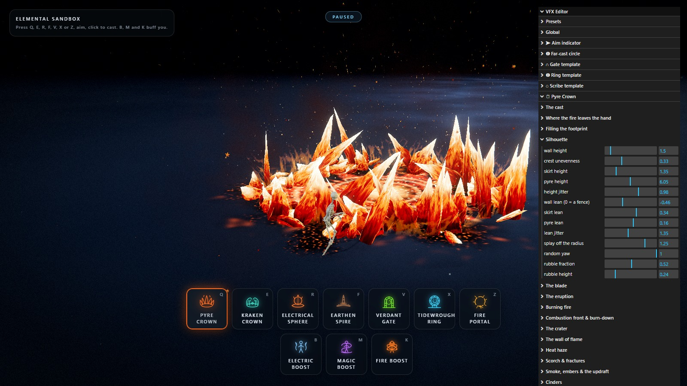

*Paused mid-eruption with **P**, the Pyre Crown's silhouette sliders open. Every one of them still
applies while the frame is frozen.*

- **Global** multipliers scale everything at once (speed, glow, noise, particles, lights, impact
  intensity, camera shake, time scale…).
- **Aim indicator** (33 controls) — the arrow's silhouette in metres, its outline and fill, the
  chevrons and frost, and the rings and rosette.
- **Far-cast circle** (41 controls) — the boundary band, the interior, the ticks, sweep and
  reticle, the reach ring, and the snap-out. Shared by every far cast, so it is filed with the
  targeting rather than with any one ability.
- **Gate template** (34 controls) — the threshold, the standing arch ghost, the reach ring, and
  the rendering. Shared by the gate cast.
- **Ring template** (43 controls) — the contour, the sigil, the tipping ghost, the reach ring.
  Shared by the ring cast.
- **Scribe template** (23 controls) — the circle, the reach ring. Shared by the scribe cast.
- **Pyre Crown** (222 controls, 36 of them colours) — the cast, where the fire leaves the hand,
  filling the footprint, the silhouette, the blade, the eruption, burning fire, the combustion
  front and burn-down, the crater, the wall of flame, heat haze, scorch and fractures, smoke,
  embers and the updraft, cinders, bloom and blaze, and the dynamic light.
- **Kraken Crown** (244 controls) — the cast, where the wave leaves the caster, filling the
  ring, the arm, the poses, the travelling wave, the beat, the flesh, chromatophores and
  biolume, the suckers, coming out of the rift, the smash, the rift, the curtain of spray, wet
  stone and fractures, ink, spray and marine snow, broken floor, the tear and the standing
  crown, and the dynamic light.
- **Electrical Sphere** (206 controls) — the cast, where it leaves the hand, the sphere, the
  reflective shell, charge under the skin, hex panelling (off by default), surface discharge,
  Fresnel light, the ground platform, radial corona, per-arc shape, the corona ribbon, the
  pulse, sphere colours, corona colours, platform colours, ground burns, sparks and motes,
  sphere-shed particles, muzzle and impact, and the dynamic light.
- **Earthen Spire** (75 controls) — the cast, where the wave leaves the caster, the travelling
  wave, the plates, travelling boulders, the tower, the rock, the tower glass body, outline
  glow, dust and debris, and the impact.
- **Verdant Gate** (77 controls) — the cast, where the seam leaves the caster, the opening, the
  stones, the construction, the portal, colour, motes, mist and dust, and light and impact.
- **Tidewrought Ring** (96 controls) — the cast, where the tide leaves the caster, the ring, the
  segments, the forging, standing up, the rift, the runes, coming apart, colour, motes, spray
  and mist, and light and impact.
- **Fire Portal** (58 controls) — the cast, the circle, struck — the spark that draws it, the
  ring, the middle, the sparks, spark colour over its life, and the light.
- **Electric Boost** (172 controls) — the buff, Fresnel on the character, veins and sweep, the
  arcs, the body they are struck on, the shape of one arc, the ribbon, sparks and motes, the
  crater under the feet, rings around the crater, uprights across the circle, the coil ribbon,
  burns under the feet, dynamic light, and charge and release.
- **Magic Boost** (148 controls) — the buff, Fresnel on the character, veins and sweep, the
  ribbons, how far a ribbon wanders, the sheet, the smoke on the floor, smoke and motes, rings
  under the feet, dynamic light, and open and close.
- **Fire Boost** (208 controls) — the buff, Fresnel mask on the character, veins and sweep, the
  skeleton the fire is rooted on, the tongues, the sheet a tongue is drawn on, the orbs, how an
  orb burns, the trails, the burn on the floor, embers and smoke, scorches under the feet,
  dynamic light, and catch and burn out.
- **Presets** save to `localStorage`, and can be duplicated, deleted, exported to JSON, imported
  from JSON, or reset to the shipped defaults.

Every ability exposes **every** colour it draws with, and none is derived from another: the blade
palette, the arm palette, the sphere's four layers, the portal's surface, the rift's pool, the
ground marks, the impact shells, the shockwave rings, the screen flashes, and a four-stop lifetime
gradient (`birth → early → late → death`) for each particle system. Tinting the wall of flame
without touching the blades, or cooling the sparks to orange while the corona stays blue, is a
picker away.

Presets are plain snapshots of the settings tree, so an exported file is readable and editable by
hand.

Knobs worth knowing about, because they reshape their ability the most:

- `pyre.heightCurve` and `pyre.frontBias` — how late the ramp climbs, and how crowded the
  blades are toward the impact point. `pyre.riseSnap` and `pyre.creep` decide whether the
  eruption reads as something hot settling (current default) or as something bouncing onto
  height.
- `kraken.zoneRadius` and `kraken.arms` — the footprint, and the count of heavy arms on the
  boundary. The arms' length is *derived* from the radius through the closed form for a
  constant-curvature arc, so the slam point is arithmetic, not tuned. `kraken.cycleScatter`
  carries the rolling-thunder character; `kraken.finaleLead` carries the synchronized slam.
- `electrical.radius` and `electrical.arcs` — how heavy the sphere reads, and how busy the
  corona is. `electrical.pulseFrequency` and `electrical.pulseStrength` are the heartbeat; they
  run on a smooth envelope that drives both the materials' `uPulse` uniform and the particle
  rates, so the whole effect breathes together.
- `earth.towerHeight` and `earth.crustWidth` — the height of the standing tower, and the
  width of the plate band the travelling front leaves behind it. `earth.crackDelay` is the gap
  between the head and the fracture wave, and the tower's glow comes from `earth.glow` on the
  glass body inside the procedural cylinder.
- `portal.span` and `portal.keystoneHang` — how wide the arch is, and how long the keystone
  hangs before it seats. The opening itself is one SDF on a quad, so the aperture can flood
  open and the span can be dragged without anything being rebuilt.
- `aether.ringRadius` and `aether.standUpOver` — the size of the hoop, and how long it takes
  to hinge from the floor to standing. The spin is analytic, so re-posing on a paused frame
  costs nothing.
- `firePortal.ringRadius` and `firePortal.scribeTime` — the size of the hole, and how long the
  spark takes to run round. `firePortal.ringInner` is the one slider that can ruin it: past a
  couple of centimetres the bloom licks back over the hole and the middle lights up.
- `zone.boundary` and `zone.snap` — how thick the far-cast circle's edge reads, and how hard
  it overshoots on the way out. Between them they decide whether the indicator feels like a UI
  overlay or like something the caster is doing.

---

## Performance notes

- Abilities, decals, bursts and particles are pooled, per type. Twelve casts in a row build at
  most **four** instances of an ability and then stop allocating.
- The whole blade field is three draw calls regardless of blade count; the cap is 320 across the
  three silhouettes.
- A whole kraken cage is two draw calls regardless of arm count, plus one for the rift; the cap
  is 26 arms plus whips, and none of the pose touches the CPU, so the strike cycle is free.
- A whole electrical sphere is three draw calls — the body, the platform, the corona — plus one
  instanced ribbon strip shared with the rest of the project. `electrical.arcs` is the count of
  arcs in the corona, and the whole effect is one mesh per surface.
- The gate is one instanced mesh of `createBlockGeometry` plus the portal quad and its halo;
  the ring is the same arrangement with the ring's own block seed.
- The six dynamic point lights are created at boot and parked at zero intensity rather than
  added and removed — changing the light count forces three to recompile every material.
- Shadow maps update exactly once per frame even though the scene is rendered several times.
- `renderer.compileAsync()` runs during boot so the first cast never stutters on shader compile.
- Pixel ratio is capped at 1.75; the depth and distortion buffers are half resolution.

Measured on a default cast: 32 draw calls idle, ~110 with a full pyre standing, ~95 with a kraken
mid-strike, and ~70 with an electrical sphere hovering. Four concurrent casts — the pool's
ceiling, whichever slots they came from — peak at ~220 draw calls and five of the six dynamic
lights.

Live counters (FPS, live particles, instances, draw calls) are in the top-right of the HUD.

---

## The archive

`src/archive/` holds the previous incarnation of this project: a four-element bending sandbox
(fire, water, earth, air) cast along a freehand-drawn spline, plus a walk mode that let the
avatar ride the same stroke. None of it is imported by the live app, so Vite never bundles it.

It was retired because this build replaced path drawing with a linear skillshot, which removed
the input every one of those systems was built on. The raymarched flame and water surfaces in
particular are worth mining. See `src/archive/README.md` for what is in there and how to restore
a piece of it.

---

## Known rough edges

- Blades, plates, blocks, arms and the tower are drawn with `transparent: true` and
  `depthWrite: true`. That is the right trade for near-opaque stone and it keeps the field
  from sorting through itself, but at low `*.opacity` the sorting artefacts between overlapping
  pieces become visible.
- The travelling front is a straight line on a flat floor. Both assumptions are baked in — the
  ground is a single plane at y = 0, and the aim raycast targets that plane.
- The far cast inherits the flat-floor assumption twice over: the circle is drawn on a single
  quad at `y = 0`, and the pyre's scorch and the kraken's rift are placed against that same
  plane. Neither would drape over a step.
- Both the targeting circle and the pyre's wall of flame are additive, so the footprint
  brightens the floor rather than shading it. On a pale floor the boundary would need a
  non-additive pass under it to stay readable.
- The electrical sphere's glass body is opaque, so a sphere dropped behind a standing gate will
  not see the gate through the body. The fix is a transparency pass on the body, but that
  breaks the depth read against the platform; the trade as it stands is that the sphere always
  reads as solid.
- The Earthen Spire's tower builds in courses that are spaced uniformly; at very low
  `towerHeight` the lowest course compresses against the floor, which can let the ground
  light leak between segments.

---

## Licence

Code is provided as-is for the purposes of this project. The bundled HDR probe, the character
FBX, and the cathedral texture set retain their original licences.
