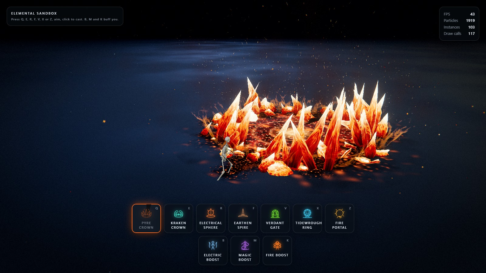

# 원소 샌드박스 — Three.js 한글판

> 원본 [achrefelouafi/LinearAbilityExtThreeJS](https://github.com/achrefelouafi/LinearAbilityExtThreeJS) 의 **포크가 아닌 한글화 사본**입니다. 모든 게임 로직·렌더링·자산은 그대로 두고 사용자 노출 문자열(메뉴, HUD, 토스트, 에디터 라벨 등)만 한국어로 옮겼습니다.

**<a href="https://sigco3111.github.io/LinearAbilityExtThreeJS/" target="_blank">🎮 라이브 플레이 — sigco3111.github.io/LinearAbilityExtThreeJS</a>**

스킬샷 VFX 샌드박스를 **Three.js**, **Vite**, 직접 작성한 **GLSL**로 만들었습니다.

